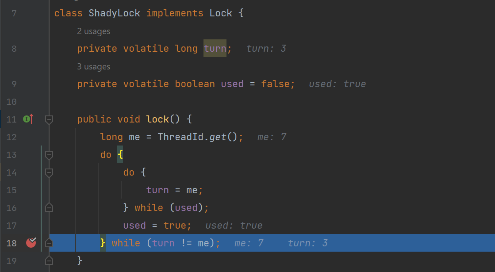

# Exercitiul 3.a)

O echipa de programatori a dezvoltat algoritmul de lock prezentat in pseudocodul urmator. ThreadId se considera a fi o clasa ce furnizeaza un id unic pozitiv fiecarui thread.

Grupele de la seria A: Intr-o executie concurenta a n > 1 thread-uri, este acest algoritm starvation-free? Argumentati.

## Rezolvare

Acest algoritm **nu este starvation free**, pentru ca el nu este în fapt deadlock free, căci este posibil ca nici un thread sa nu obtina lacatul. Problema se manifesta în linia 9 și linia 12 din clasa ShadyLock. 
Înainte ca oricare thread să apeleze metoda lock(), atributul used este fals. Primul thread t1 care ajunge la linia 9 seteaza turn = me, după care poate ieși din bucla la linia 10 deoarece used = false. t1 ajunge la linia 11 și seteaza used = true. Dacă în acel moment  un alt thread t2 ajunge la linia 9 și seteaza turn = me, pentru t1 condiția din bucla de la linia 12 va fi evaluata ca true, deci va intra in bucla de la linia 7, iar cand va ajunge la linia 10, condiția din bucla imbricata va evaluata ca true, deoarece t1 setase used = true în prima iterație cand a ajuns la linia 11, deci t1 va reintra in bucla la infinit deoarece nu poate seta used = false, iar toate celelalte threaduri de asemenea vor fi blocate în bucla de la liniile 8-10.

### Exemplu

Thread-ul cu Id 7 cand ajunge la linia 18 după ce a setat used=true constata că (turn != me) deoarece threadul cu Id 3 ajunsese deja la linia 15 și a setat turn = me, deci thread-ul cu Id 7 e forțat sa intre din nou în bucla.

Chiar dacă thread-ul cu Id 7 a setat din nou turn = 7, din cauza ca anterior setase used = true, acum nu mai poate ieși din bucla nici acest thread, nici alte thread-uri.

