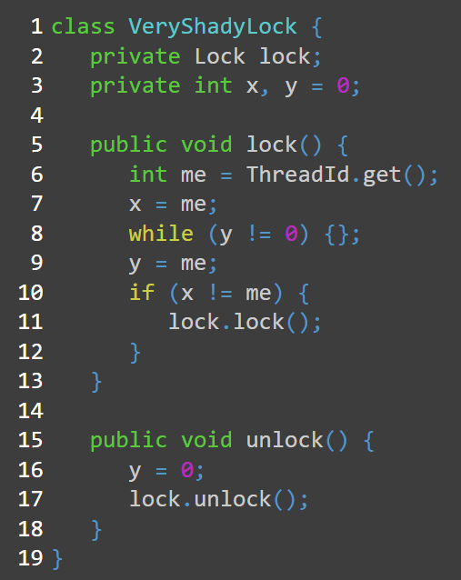
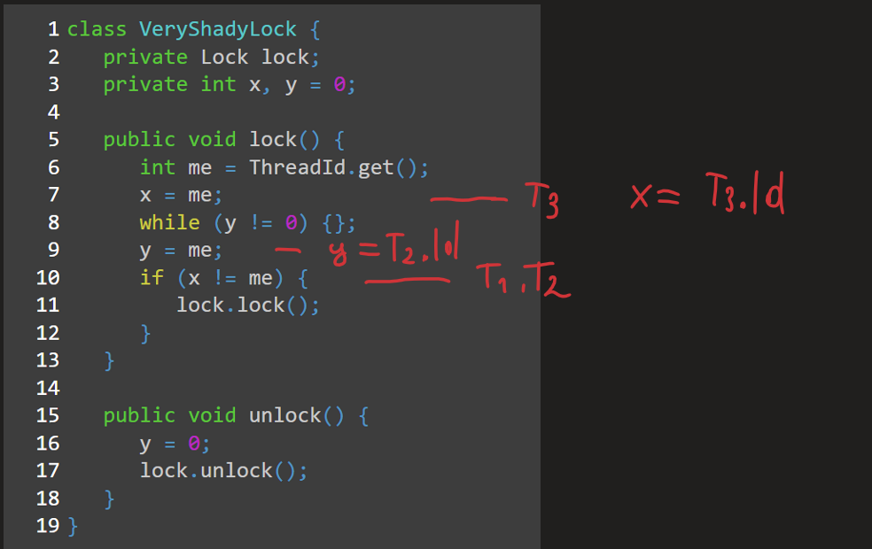
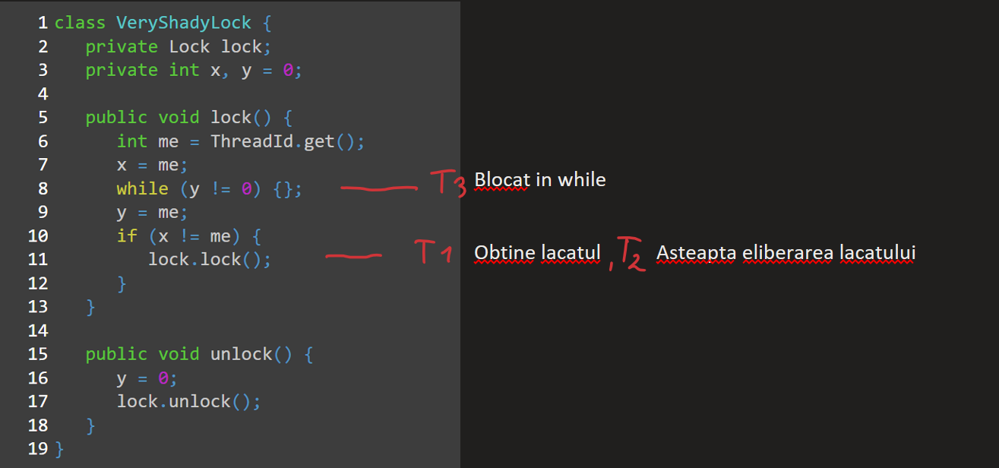
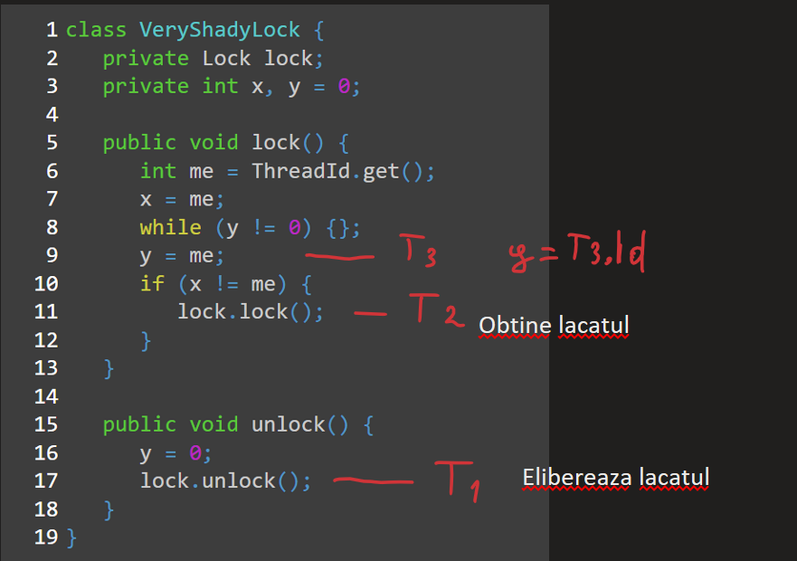
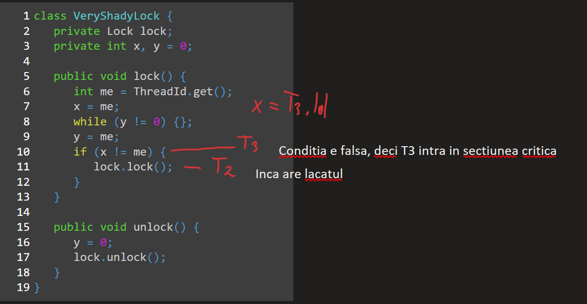

# Exercitiul 3.b)

 O alta echipa de programatori a dezvoltat algoritmul de lock prezentat in pseudocodul urmator ce incapsuleaza un alt lock oarecare. Se considera ca lock-ul incapsulat asigura corect excluderea mutuala si este starvation-free. De asemenea lock-ul incapsulat permite un apel unlock fara exceptie si fara efect chiar daca nu a existat un apel lock. ThreadId se considera a fi o clasa ce furnizeaza un id unic pozitiv fiecarui thread.

Grupele de la seria A: Intr-o executie concurenta a n > 1 thread-uri, asigura acest algoritm excluderea mutuala? Argumentati.

## Rezolvare

Pentru ca algoritmul să asigure excluderea mutuala, trebuie sa ne asigurăm ca este imposibil ca mai multe threaduri sa ajungă în secțiunea critică în același timp. Acest algoritm asigura excluderea mutuala doar pana la ultimul thread care vrea sa intre în secțiunea critică. Un exemplu ilustrativ ar fi cazul în care threadurile t1 și t2 au executat linia 9, iar t3 linia 7.  Condiția de la linia 10 este adevărată pentru ambele, deoarece x = t3.Id, deci atat t1 cât și t2 pot apela lock.lock() unul după altul, însă deoarece lacatul incapsulat  asigura excluderea mutuala, doar unul din t1 și t2 va obține lacătul, pe cand celalalt va trebui sa astepte eliberarea lacatului, iar t3 ramane blocat in while la linia 8. Totuși, chiar dacă t2 așteaptă în interiorul lock-ului de la linia 11 ca t1 sa faca unlock, odată ce acest unlock() e apelat de t1, t3 va ieși din while, în funcția unlock instrucțiunea y = 0 fiind înainte de lock.unlock(), iar t2 va prelua lacatul. Însă chiar daca t2 deține acum lacatul, t3 ieșind din while de la linia 8 va ajunge la linia 10, unde condiția x != me e verificata ca fiind falsa, deci t3 nu apelează lock.lock(), rezulta ca t3 intra in secțiunea critică fără a fi nevoit sa aștepte ca t2 să apeleze unlock(), deci este posibil ca t3 și t2 să aibă access în secțiunea critică în același timp, de unde putem trage concluzia că VeryShadyLock **nu asigura excluderea mutuala**.

