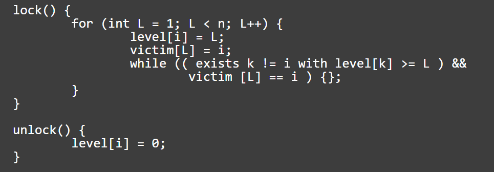
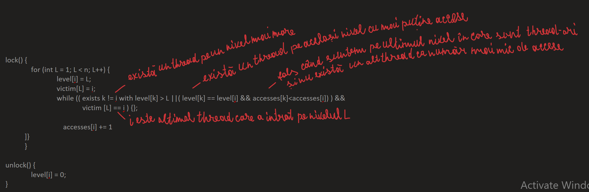

# Exercitiul 1

Consideram algoritmul lui Peterson de excludere mutuala ce ofera o generalizare pentru n thread-uri enuntat in laboratorul 3, ale carui metode sunt redate in pseudocodul de mai jos. Reamintim ideea acestuia de a trece fiecare thread printr-un filtru de n-1 nivele pana la accesul la sectiunea critica. i poate fi considerat ca identificator al unui thread iar L ca numar al nivelului. Tabloul level asociat nivelelor retine nivelul curent pentru fiecare thread, iar tabloul victim retine identificatorul fiecarui ultim thread ce a avansat la respectivul nivel.

## Intrebare 1

De ce credeti ca algoritmul lui Peterson generalizat in acest mod nu este echilibrat (fair)? Incercati sa descrieti un exemplu concurent de executie ca raspuns.

## Solutie 1

Algoritmul lui Peterson nu este fair deoarece verificarea instrucțiunii din while loop necesita un anumit timp, deci un alt thread care vine din urma ar putea întrece un alt thread care a fost nevoit sa stea mai mult în loop. Sa presupunem ca avem 3 thread-uri t0, t1 și t2, t0 si t1 unul după altul cu t0 un pic mai rapid, iar t2 după ambele. In acest caz avem t0 si t1 care intra în while loop, cu victim[1] = 1.  Daca intra si t2 în while loop imediat, t2 va trebui sa evalueze condiția din loop de 3 ori:1. in acest moment, cand toate cele 3 thread-uri sunt în faza de evaluare a condiției;2. la următorul loop când doar t1 și t2 evaluează condiția la nivelul 1; 3. la loop-ul de după aceea cand va ramane t2 singur pe nivelul 1 și va putea trece la următorul. În acest timp însă, t0 va avea un avantaj din punctul de vedere al nivelelor, și după ce își va termina activitatea în sectiunea critica si ar reporni de la nivelul 0 ar putea ajunge din nou în competiție cu t2 pe același nivel.

## Intrebare 2

Gasiti o varianta de imbunatatire pentru a asigura garantia de fairness si implementati algoritmul in acest mod. Odata pornite n thread-uri niciunul dintre acestea nu ar trebui sa poata accesa sectiunea critica protejata de lock mai des ca celelalte.

## Solutie 2

Aceasta schimbare în cadrul algoritmului promovează fairness prin faptul ca permite unui thread care de abia a intrat pe un anumit nivel să treacă la următorul nivel în detrimentul celorlalte thread-uri dacă nu exista alt thread pe acest nivel care să fi avut un număr de tranziții la alte nivele mai mic decat thread-ul curent.

