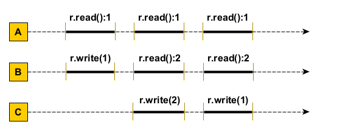
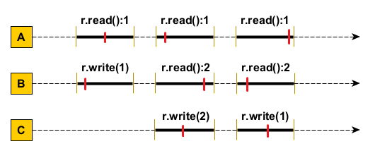

# Exercitiul 1

Se da urmatoarea secventa (istorie) de executie de mai jos. Este aceasta linearizabila? Dar consistent secventiala? Se considera valoarea initiala r = 0.

Argumentati raspunsul oferind explicatiile (eventual secventa istoriei de executie) si/sau o diagrama cu punctele de linearizare dupa caz.

## Rezolvare

Secventa **este linearizabila**, deoarece metodele pot fi invocate intr-o succesiune logica, un exemplu de istorie a executiei ar putea fi:

> Thread B: r.write(1) -> Thread A: r.read():1 ->
>
> Thread A: r.read():1 -> Thread C: r.write(2) ->
>
> Thread B: r.read():2 -> Thread B: r.read():2 ->
>
> Thread C: r.write(1) -> Thread A: r.read():1

Se pot observa punctele de linearizare:

Secventa fiind linearizabila, este si **consistenta secventiala**, deoarece nu exista nici o secventa de executie care sa nu fie posibila in secventa istoriei de executie.
